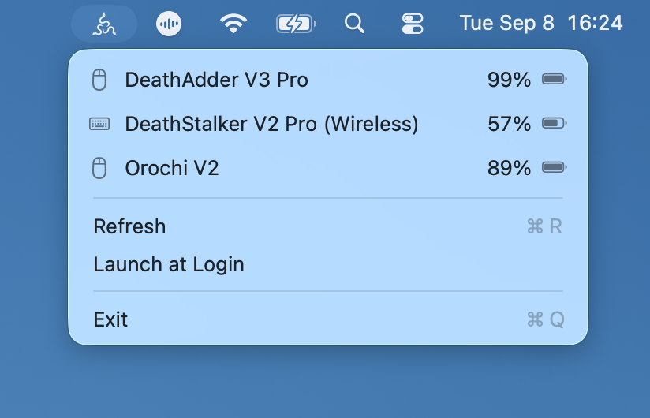

# RazerMon — Razer Battery Monitor for macOS

RazerMon is a native, read-only macOS menu bar battery monitor for compatible wireless Razer mice and keyboards. It shows battery percentages for supported HyperSpeed, USB receiver, and Bluetooth device endpoints without requiring Razer Synapse.

Current version: **0.3.0**



This is an independent, unofficial open-source project. It is not affiliated with or endorsed by Razer Inc. Razer and related product names are trademarks of their respective owners.

RazerMon supports a broad and growing range of battery-powered Razer keyboards and mice using wireless, HyperSpeed, receiver, or Bluetooth connections. Wired-only hardware is intentionally excluded because it has no battery level to monitor. Device support is data-driven, so compatible hardware can work without model-specific Swift code.

See the [RazerMon supported wireless devices list](docs/SUPPORTED_DEVICES.md) for the current keyboard and mouse catalog. For setup and compatibility questions, see the [Razer battery monitoring FAQ for macOS](docs/FAQ.md). Hardware reports and pull requests are welcome.

RazerMon only sends device identity, paired-product, and battery-level queries. It does not modify lighting, DPI, pairing, profiles, or key bindings.

## Features

- Shows Razer mouse and keyboard battery percentages in the macOS menu bar
- Detects compatible wireless devices when they connect or disconnect
- Supports compatible HyperSpeed receivers, dedicated USB receivers, and Bluetooth endpoints
- Uses event-driven device monitoring and cached battery readings to minimize CPU use and power consumption
- Refreshes device topology immediately when the menu opens
- Pauses transient checks during system sleep and synchronizes once after wake
- Runs natively on Apple silicon and Intel Macs
- Localized in English, Simplified Chinese, Traditional Chinese, Japanese, Korean, German, French, Spanish, Brazilian Portuguese, Italian, and Russian
- Requires no kernel extension and makes no device configuration changes

## Requirements

- macOS 13 or later
- Xcode with Swift 5.9 or later when building from source
- Input Monitoring permission

## Build and Install from Source

Clone this repository and open the project in Xcode:

```sh
open RazerMon.xcodeproj
```

Select the **RazerMon** scheme and **My Mac**, then press `Command-R` to build and run. The project uses local ad-hoc signing by default and does not contain a development team or certificate configuration.

To create a Release build from the command line:

```sh
DEVELOPER_DIR=/Applications/Xcode.app/Contents/Developer \
  xcodebuild -project RazerMon.xcodeproj \
  -scheme RazerMon \
  -configuration Release \
  -derivedDataPath build \
  CODE_SIGNING_ALLOWED=NO build
```

The resulting application is located at `build/Build/Products/Release/RazerMon.app`. Install and launch it with:

```sh
ditto build/Build/Products/Release/RazerMon.app /Applications/RazerMon.app
open /Applications/RazerMon.app
```

On first launch, follow the in-app instructions to open **System Settings > Privacy & Security > Input Monitoring**, add RazerMon, and enable access. Install the application in `/Applications` before granting permission so its path and permission identity remain stable.

RazerMon appears only in the macOS menu bar and does not display a Dock icon. Open its menu to view devices and battery levels, refresh immediately, manage launch at login, or quit. Device discovery runs immediately when the menu opens and reacts to system device events. While the menu remains open, a 15-second fallback check covers devices paired behind receivers that do not emit a macOS attach or removal event. Battery values are cached independently for five minutes: new devices are read immediately, unchanged devices reuse fresh values, and removed devices are discarded without another battery query. The menu is rebuilt only when displayed data changes, and the low-frequency background refresh runs every 15 minutes with power-efficient timer tolerance. RazerMon pauses transient menu checks before system sleep and performs one device synchronization after wake; it does not create a power assertion or prevent display, idle, or lid-close sleep.

The application uses App Sandbox with USB device access. After installing it in `/Applications`, use **Launch at Login** in the menu to control whether it starts when you sign in.

## Protocol Validation

Every response must have the expected 90-byte length and pass XOR checksum, transaction ID, command class, and command ID validation. Serial numbers are deduplicated so cached responses from other transactions are not reported as additional devices.

Protocol behavior remains implemented in type-safe Swift adapters. Wireless device names, product IDs, device kinds, and candidate protocol mappings are stored in the bundled read-only [`Resources/DeviceCatalog.json`](Resources/DeviceCatalog.json). Wired-only devices are not included. This keeps hardware additions reviewable without allowing configuration data to define arbitrary HID commands.

## Device Catalog Source

Device names and USB IDs are derived from the [OpenRazer device support list](https://github.com/openrazer/openrazer) at the revision recorded in the catalog. OpenRazer support indicates that a device is known to its Linux drivers; it does not by itself establish compatibility with RazerMon's macOS battery protocol.

## Related Documentation

- [Supported wireless Razer keyboards and mice](docs/SUPPORTED_DEVICES.md)
- [Razer battery monitoring FAQ for macOS](docs/FAQ.md)
- [Latest RazerMon release](https://github.com/ab4317/RazerMon/releases/latest)
- [Report a device compatibility issue](https://github.com/ab4317/RazerMon/issues/new)

## License

[MIT](LICENSE)
